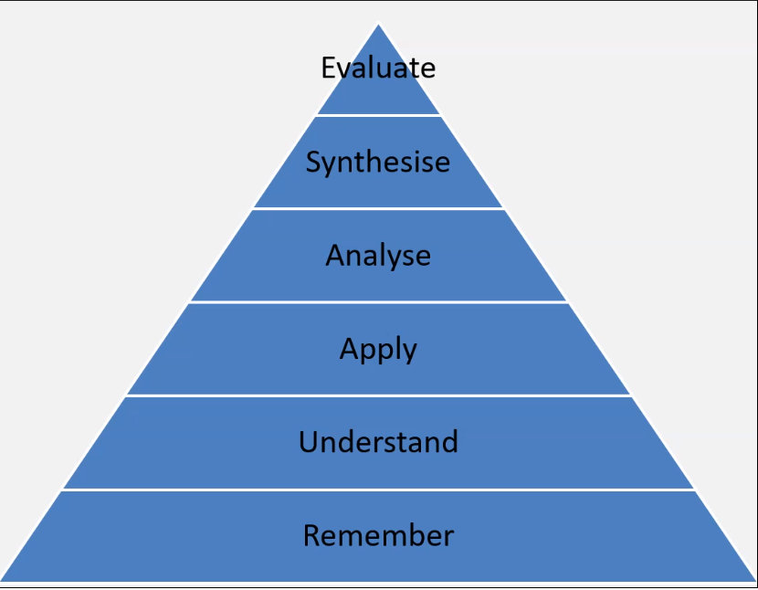
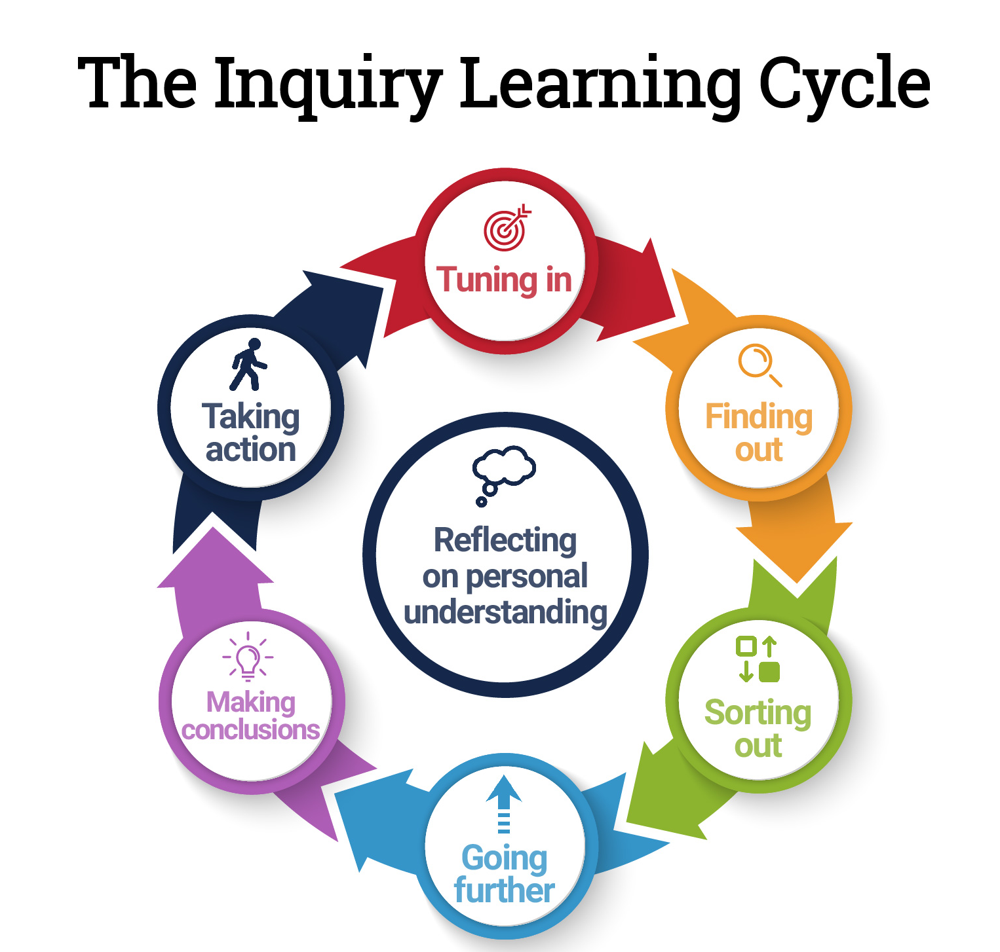

# Critical Thinking
## What is Critical Thinking?
- Develop techniques for thinking reading and writing critically
- To understand the formal structure of a debate
- To develop techniques for how to participate in debates meaningfully

## Why is it important?
- Helps you to create strong arguments by justifying your claims with the evidence you have gathered and evaluated
- Can contribute to any role as it requires the ability to gather information, analyse it and evaluate it
- Trying to find the truth

## Critical Thinking Skills
- Actively seeking out all sides of an argument
- Checking the facts and evidence
- Responding objectively

## Thinking Triangle
Remember key facts , understand the fact, apply the understanding to try to solve problems. Analyse the solution to your problem and then synthesise the ideas by gathering all information into new solution.

## Critical Thinking Processes

Identify:
- The main points identified
- The claims being made
- The evidence used
- The conclusions reached

Analyse:
- Does the information make sense in relation to research?
- How old is the material?
- Is the material clear or do you need to find additional information to aid understanding?
- Does the argument present a balanced view or are some topics disregarded?

Apply:
- The implications of other information
- Weaknesses when applied to a real-life situation
- A lack of coverage

## Incorrect Attitudes
Neither ways of thinking below are correct and will prevent you from embracing critical thinking with an open and objective mind

Ignorant Certainty
	- Belief that there are definite answers to all questions

Naïve Relativism
	- The belief that there is no truth and all arguments are equal

## What is Enquiry-Based Learning?
- Learning based upon questions asked about a problem or incident in order to understand the situation and make a decision

## The Enquiry Cycle

## What questions might we ask when critically thinking?
- What is the source of evidence?
- What did others see?
- Where is the evidence for these claims?
- What are the strengths and weaknesses?
- How clear are the points?
- Is it a balanced argument?

## What questions might we ask when critically thinking?
- What is the source of evidence?
- What did others see?
- Where is the evidence for these claims?
- What are the strengths and weaknesses?
- How clear are the points?
- Is it a balanced argument?

### What is an argument?
- Exchange of diverging views based on views or research

### Basic Structure
- Claim (Present your argument in a clear statement)
- Evidence (Present evidence to support your claim)
- Impact (Explain the significance of the evidence)
## Evaluating an argument

### Coherence
- Do claims make logical sense?
- Are the claims based on opinion or supported with evidence
- Are any assumptions made?
- Have all alternatives been considered?

### Supporting Evidence
- Does the evidence support all claims made?
- What is quality of evidence?
- Quality of data?
- Quality of interpretation?

## What if we want to challenge the argument?
- Acknowledge the other person's view before challenging it
- Be constructive rather than simply dismissing the other person's point of view
- Reflect on the strengths of the other person's argument
- Think about your language and whether you risk being offensive before you speak

## Debating Language
### Do-s
- It can be argued that
- … tends to …
- There is evidence to suggest that
- It has been said that …
### Don't-s
- "I.."
- "I think that…"

 ## Logical Fallacies to look for
- False dichotomy - where the speaker forces the debate into two side, though there are more options available
- Assertion - When the speaker presents a statement as fact which appears invalid or may be an assumption
- Morally flawed - arguments which go against the code of ethics and morals
- Correlation rather than causation - when a speaker suggests a link between two events suggesting one lead to another
- Failure to deliver promises - might fail to complete a task such as evidence they said they'd provide
- Straw man - the speaker intentionally introduces an argument against them and rebut it to strengthen their position
- Contradictions - Speakers argument may contradict their previous argument and reduce their credibility
- Compare the conclusion to reality - Consider what would happen if the motion became reality.

# The Art of Persuasion
- Ethos - Appealing through authority or credibility (Convincing audience they are qualified to speak on it.)
- Pathos - Appealing through emotional empathy (Passionate Delivery)
- Logos - Appealing through logic and reasoning (Using facts)

## Important skills for persuasion and debate
- Keep points relevant
- Provide evidence and not opinion
- Remain objective
- Consider audience's attention span
- Use notes but keep them brief and organised
- Accept mistakes and apologise for them
- It's okay to agree with someone

### Do
- Be prepared
- Stay calm
- Speak clearly and confidently
- Keep language simple
- Active listening

### Don't
- Falsify or alter evidence
- Publicly disagree with decision
- Attack a speaker rather than the motion
- Act aggressively or offensively
- Interrupt others
-Disagree with facts or obvious truths
