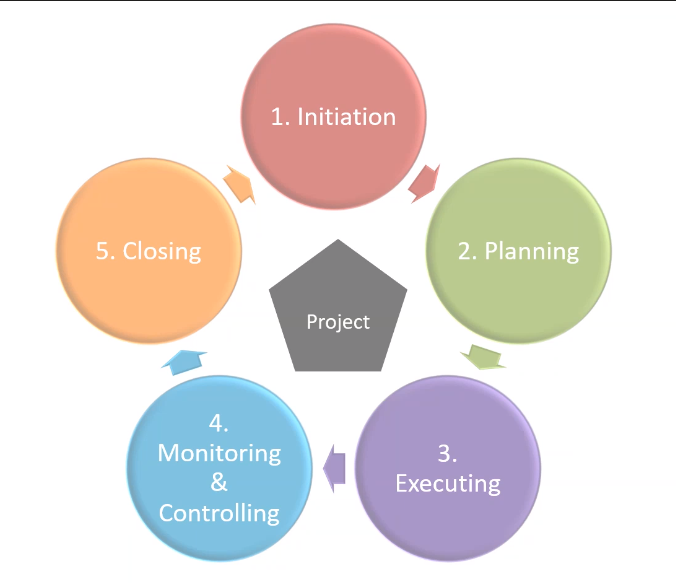

# Project Environments

## Objectives
- Understand the difference between BAU (business as usual) and Project work

- Have clear understanding of a project life cycle

## Project vs BAU
- BAU (normal things in the running of a company, day to day routine) - the normal execution of standard operations with an organisation
- Project (specific things which are happening in the company) - unique and transient with a desired outcome

## Optimisational strategy 

	1. Initialisation - Start the project 
	2. Plan - Plan what you are going to do
	3. Execute - Execute the plan
	4. Monitor - Monitor the progress
        5. Closing   

