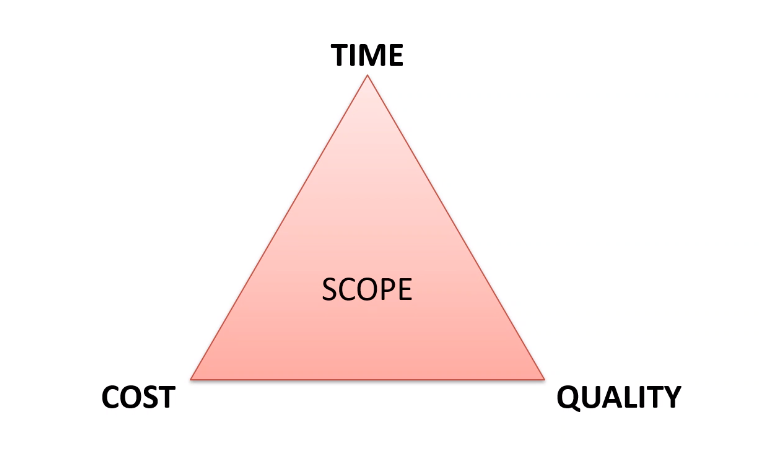

# Project Environments

## Objectives
- Understand the difference between BAU (business as usual) and Project work

- Have clear understanding of a project life cycle

## Project vs BAU
- BAU (normal things in the running of a company, day to day routine) - the normal execution of standard operations with an organisation
- Project (specific things which are happening in the company) - unique and transient with a desired outcome

## Optimisational strategy 

1. Initialisation - Start the project 
2. Plan - Plan what you are going to do
3. Execute - Execute the plan
4. Monitor - Monitor the progress
5. Closing   

## Triple Constraint
Finding a balance in this triangle can be tricky and when one thing changes the others will have to change in order to maintain balance.

## POPIT model aka Holistic Triangle
The idea behind this diagram is that technology connects all the other sub triangles.

## Benefits of a Project Being Managed Well

- Improved planning and scheduling.
- Better collaboration.
- Effective task delegation.
- Easier file access and sharing.
- Easier integration of new members.
- Effective risk mitigation.
- Budget management.
- Remote working.

## Software Development Cycles

## Attributes of mature teams
- Co located
- Cross functional roles
- Self-organising
- Accountable and empowered
- Test and learn feedback loops

## When Projects are Difficult
- Create positivity
- Manage conflict intelligently
- Clear and open communication
- Respect all your peers
- Be trustworthy

## ROI

- Return on Investment (ROI) - return on the initial investment for a project
- Comes down to worth of product to people who need it

## How to Identify Risk

## Sources of risk
- Technology
- Team
- Scope
- Business
- Economy
- Competition

## Dealing with Risk
- Avoidance
- Transfer
- Reduce
- Accept
- Exploit
- Share
- Enhance
- Ignore

## Stakeholders and Their Attributes

### Stakeholder Attributes
- Champion - fight for cause of project with data and logical reasoning
- Supporter - support project and speak favourably on behalf of project
- Neutral - won't fight for project or oppose
- Critics - Criticise project

### Power / Interest Grid

## DevOps

- DevOps doesn’t necessarily need to know how to build product but know how to deploy it

- DevOps covers a lot of these areas as it is cross functional meaning bridges gap between development and operations automating the system 

- DevOps breaks down silos to work together share responsibilities and automate the development pipeline delivery faster time to market continuous release cycles and increased quality due to automated testing

